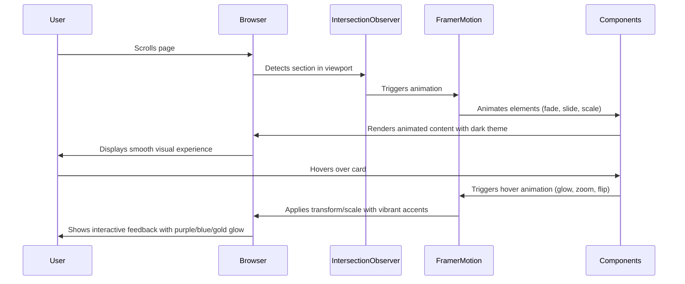

# Design Document: Visual Enhancements V2

## Overview

This design document specifies comprehensive visual enhancements for the Quein Conference & Event Organization WLL website, transforming it into a modern, dark-themed event management platform inspired by cutting-edge entertainment and event websites. The design embraces a **dark theme as the primary aesthetic** with vibrant purple, blue, and gold accents, creating a luxury experience that reflects Quein's brand promise: **"Where Every Occasion Finds Its Grandeur"**.

The enhancements integrate official Quein content across all sections, including service categories (Private Events, Exhibitions, Conferences, Marriage Events), company story, vision, mission, and values. The design incorporates modern elements from reference entertainment/event websites: animated gradient backgrounds, large typography hero sections, card-based layouts with sophisticated hover effects, event portfolio galleries, animated statistics counters, team showcases, testimonial carousels, and newsletter subscription sections.

All enhancements maintain the luxury/premium positioning while prioritizing performance (Lighthouse >80), accessibility (WCAG AA), responsive design, and smooth scroll animations throughout the user journey.

## Main Algorithm/Workflow



## Design Principles Inspired by Reference Images

### 1. Dark Theme as Foundation
**Principle**: Dark backgrounds create luxury, focus attention on content, and make vibrant accents pop

**Implementation**:
- Primary background: #0A0A0A (deep dark)
- Secondary background: #050505 (darker for contrast)
- Card backgrounds: #1A1A1A (elevated dark)
- Never use light backgrounds - dark theme is the identity

**Reference Inspiration**: Entertainment/event websites use dark themes to create immersive, premium experiences that highlight visual content

### 2. Vibrant Accent Colors
**Principle**: Purple, blue, and gold accents create visual hierarchy and guide user attention

**Implementation**:
- Purple (#8B5CF6): Primary accent for CTAs, headings, primary interactions
- Blue (#3B82F6): Secondary accent for links, secondary CTAs, info elements
- Gold (#F59E0B): Tertiary accent for highlights, badges, success states
- Use glow effects (rgba with 0.5 opacity) for hover states

**Reference Inspiration**: Modern event sites use vibrant colors against dark backgrounds for maximum impact

### 3. Large, Bold Typography
**Principle**: Oversized typography creates impact and establishes visual hierarchy

**Implementation**:
- Hero headlines: 72px (desktop), 48px (mobile)
- Section headings: 48px (desktop), 32px (mobile)
- Subheadings: 24px with letter-spacing
- Body text: 18px for readability
- Use font weights: 700 (bold), 600 (semibold), 400 (regular)

**Reference Inspiration**: Entertainment sites use large typography to make bold statements

### 4. Animated Gradient Backgrounds
**Principle**: Slow-moving gradients add depth and visual interest without distraction

**Implementation**:
- Newsletter section: Animated gradient (purple → blue → gold, 10s loop)
- Hero section: Subtle gradient overlay (20% opacity)
- Card hover states: Gradient borders and glows
- Use CSS animations for performance

**Reference Inspiration**: Modern event sites use animated gradients for premium feel

### 5. Card-Based Layouts with Hover Effects
**Principle**: Cards organize content and provide interactive feedback

**Implementation**:
- Dark card backgrounds (#1A1A1A) with subtle borders
- Hover effects: Lift (translateY -8px), glow shadow, scale (1.05x)
- 3D flip cards for services (rotateY 180deg)
- Image zoom on hover (scale 1.15x)
- Smooth transitions (300-600ms)

**Reference Inspiration**: Event portfolio sites use sophisticated card interactions

### 6. Event Portfolio/Gallery Sections
**Principle**: Visual showcases build credibility and inspire clients

**Implementation**:
- Masonry grid layout (varying heights)
- Category filters with smooth transitions
- Hover overlays with event details
- Lightbox modal for full-size viewing
- Lazy loading for performance

**Reference Inspiration**: Entertainment sites showcase work through visual galleries

### 7. Statistics with Animated Counters
**Principle**: Animated numbers draw attention and build trust

**Implementation**:
- Large numbers (60-80px) with counter animation
- Icons with vibrant colors and pulse effects
- Trigger animation when 30% visible
- Easing: easeOutExpo for dramatic effect

**Reference Inspiration**: Event companies use metrics to demonstrate experience

### 8. Team Showcase Sections
**Principle**: Humanize the brand with team member profiles

**Implementation**:
- Circular photos with 3D flip cards
- Front: Photo, name, role
- Back: Bio, social links
- Gradient background (purple to blue)
- Staggered entrance animations

**Reference Inspiration**: Modern agencies showcase their teams with interactive cards

### 9. Testimonials Carousel
**Principle**: Social proof through client stories

**Implementation**:
- Auto-rotating carousel (6s per slide)
- Large quote marks with scale animation
- Star ratings with fill animation
- Client photos and company info
- Pause on hover/focus

**Reference Inspiration**: Event sites use carousels for testimonials

### 10. Newsletter Subscription Sections
**Principle**: Capture leads with prominent, visually striking CTAs

**Implementation**:
- Full-width section with animated gradient
- Large heading with text reveal
- Prominent email input with glow focus
- Success animation with checkmark
- Privacy notice for trust

**Reference Inspiration**: Modern sites use gradient backgrounds for newsletter CTAs

### 11. Smooth Scroll Animations
**Principle**: Animations create flow and guide user attention

**Implementation**:
- Fade-in when sections enter viewport
- Staggered animations for card grids
- Parallax effects on backgrounds
- Text reveal animations (word by word)
- Respect prefers-reduced-motion

**Reference Inspiration**: Premium sites use subtle animations throughout

### 12. Responsive Design with Mobile-First
**Principle**: Seamless experience across all devices

**Implementation**:
- Breakpoints: 640px, 768px, 1024px, 1280px
- Mobile: Single column, simplified animations
- Tablet: 2 columns, moderate animations
- Desktop: Multi-column grids, full animations
- Touch-friendly targets (48x48px minimum)

**Reference Inspiration**: Modern sites prioritize mobile experience

## Architecture

### Dark Theme Design Philosophy

**Primary Aesthetic**: The website embraces a **dark theme as the foundation**, not as an alternative or enhancement. This creates:
- **Luxury & Sophistication**: Dark backgrounds (#0A0A0A, #050505) convey premium positioning
- **Visual Impact**: Vibrant accent colors (purple #8B5CF6, blue #3B82F6, gold #F59E0B) pop against dark backgrounds
- **Modern Appeal**: Inspired by entertainment/event industry leaders with dark, immersive experiences
- **Content Focus**: Dark backgrounds direct attention to content, images, and interactive elements

**Reference Design Elements** (from entertainment/event websites):
- Animated gradient backgrounds with slow color transitions
- Large, bold typography in hero sections
- Card-based layouts with sophisticated hover effects (zoom, overlay, glow)
- Event portfolio/gallery with masonry layouts
- Statistics sections with animated counters
- Team showcases with flip card interactions
- Testimonial carousels with smooth transitions
- Newsletter sections with gradient backgrounds
- Smooth scroll animations and parallax effects throughout

### New Section Structure

The enhanced website integrates official Quein content across these sections:

```
Navigation (existing - enhanced with dark theme)
├── Hero Section (dark background, large typography, animated gradient overlay, parallax)
│   └── Tagline: "Where Every Occasion Finds Its Grandeur"
├── **Statistics Section** (NEW - dark cards, animated counters, vibrant accents)
│   └── Years Experience, Events Completed, Happy Clients
├── Services Section (enhanced - dark cards, 3D flip animations, hover glow)
│   └── Private Events, Exhibitions, Conferences, Marriage Events
├── **Event Categories Showcase** (NEW - asymmetric dark cards, image zoom, gradient overlays)
│   └── Category-specific showcases with event counts
├── **Detailed Expertise Section** (NEW - split-screen dark layout, animated icons)
│   └── Audio Systems, Lighting, LED Screens, Stage Construction, Truss & Rigging, AV
├── Portfolio Section (enhanced - dark masonry grid, hover brightness, overlay slide-up)
│   └── Past event showcases with category filters
├── **Team/Founder Section** (NEW - dark gradient background, 3D flip cards)
│   └── Founder story, key team members
├── About Section (existing - enhanced with dark theme, Quein story/vision/mission/values)
│   └── Company background, differentiators, Qatar market expertise
├── **Testimonials Section** (NEW - dark carousel, auto-rotate, client stories)
│   └── Client feedback with ratings and event types
├── **Event Gallery/Timeline** (NEW - dark masonry layout, filter buttons, lightbox)
│   └── Chronological event portfolio with timeline markers
├── Contact Section (existing - enhanced with dark theme, gradient accents)
│   └── Contact form with validation, company information
├── **Newsletter CTA Section** (NEW - animated gradient background, text reveal)
│   └── Email subscription with privacy notice
└── Footer (existing - enhanced with dark theme)
    └── Company info, contact details, social links
```

### Component Architecture

```
components/
├── sections/
│   ├── StatisticsSection.tsx (NEW)
│   ├── EventCategoriesSection.tsx (NEW)
│   ├── ExpertiseSection.tsx (NEW)
│   ├── TeamSection.tsx (NEW)
│   ├── TestimonialsSection.tsx (NEW)
│   ├── EventGallerySection.tsx (NEW)
│   └── NewsletterSection.tsx (NEW)
├── animations/
│   ├── CounterAnimation.tsx (NEW)
│   ├── ParallaxSection.tsx (NEW)
│   ├── StaggeredCards.tsx (NEW)
│   ├── ImageZoom.tsx (NEW)
│   ├── TextReveal.tsx (NEW)
│   └── GradientBackground.tsx (NEW)
└── ui/
    ├── StatCard.tsx (NEW)
    ├── CategoryCard.tsx (NEW)
    ├── TeamMemberCard.tsx (NEW)
    ├── TestimonialCard.tsx (NEW)
    └── NewsletterForm.tsx (NEW)
```

## Core Interfaces/Types

```typescript
// Dark Theme Color System
interface DarkThemeColors {
  background: {
    primary: '#0A0A0A';      // Main dark background
    secondary: '#050505';     // Darker sections
    card: '#1A1A1A';         // Card backgrounds
    elevated: '#252525';      // Elevated elements
  };
  accent: {
    purple: '#8B5CF6';       // Primary accent
    blue: '#3B82F6';         // Secondary accent
    gold: '#F59E0B';         // Tertiary accent
    purpleGlow: 'rgba(139, 92, 246, 0.5)';  // Glow effects
    blueGlow: 'rgba(59, 130, 246, 0.5)';
    goldGlow: 'rgba(245, 158, 11, 0.5)';
  };
  text: {
    primary: '#FFFFFF';      // Main text
    secondary: '#A0A0A0';    // Secondary text
    tertiary: '#6B7280';     // Muted text
    accent: '#8B5CF6';       // Accent text
  };
  border: {
    default: '#2A2A2A';      // Default borders
    accent: '#8B5CF6';       // Accent borders
    hover: '#3B82F6';        // Hover state borders
  };
  gradient: {
    purple: 'linear-gradient(135deg, #8B5CF6 0%, #6D28D9 100%)';
    blue: 'linear-gradient(135deg, #3B82F6 0%, #1E40AF 100%)';
    gold: 'linear-gradient(135deg, #F59E0B 0%, #D97706 100%)';
    purpleBlue: 'linear-gradient(135deg, #8B5CF6 0%, #3B82F6 100%)';
    animated: 'linear-gradient(270deg, #8B5CF6, #3B82F6, #F59E0B)';
  };
}

// Official Quein Brand Content
interface QueinBrandContent {
  tagline: "Where Every Occasion Finds Its Grandeur";
  companyName: "Quein Conference & Event Organization WLL";
  description: "Crafting unforgettable experiences across Qatar";
  
  serviceCategories: {
    privateEvents: {
      title: "Private Events";
      description: "Intimate celebrations crafted with elegance and precision";
      capacity: "10-500+ guests";
    };
    exhibitions: {
      title: "Exhibitions";
      description: "Trade shows and exhibitions that captivate and engage";
      capacity: "100-10,000+ attendees";
    };
    conferences: {
      title: "Conferences";
      description: "Professional conferences with seamless execution";
      capacity: "50-5,000+ attendees";
    };
    marriageEvents: {
      title: "Marriage Events";
      description: "Weddings where every moment becomes a cherished memory";
      capacity: "50-1,000+ guests";
    };
  };
  
  aboutUs: {
    story: string;
    vision: string;
    mission: string;
    values: string[];
  };
  
  statistics: {
    yearsExperience: 15;
    eventsCompleted: 2000;
    happyClients: 200;
  };
}

// Statistics Section
interface Statistic {
  id: string;
  value: number;
  suffix: string;
  label: string;
  description: string;
  icon?: string;
  iconColor: 'purple' | 'blue' | 'gold';
  glowColor: 'purple' | 'blue' | 'gold';
  animationDuration?: number;
}

// Event Categories
interface EventCategory {
  id: string;
  title: string;
  description: string;
  imageUrl: string;
  eventCount: number;
  tags: string[];
  accentColor: 'purple' | 'blue' | 'gold';
  featured?: boolean;
}

// Expertise/Services
interface ExpertiseItem {
  id: string;
  title: string;
  description: string;
  icon: string;
  features: string[];
  imageUrl?: string;
  accentColor: 'purple' | 'blue' | 'gold';
}

// Team Members
interface TeamMember {
  id: string;
  name: string;
  role: string;
  bio: string;
  imageUrl: string;
  socialLinks?: {
    linkedin?: string;
    email?: string;
  };
}

// Testimonials
interface Testimonial {
  id: string;
  clientName: string;
  clientRole: string;
  clientCompany: string;
  quote: string;
  rating: number;
  eventType: string;
  imageUrl?: string;
}

// Gallery Items
interface GalleryItem {
  id: string;
  title: string;
  date: string;
  category: string;
  imageUrl: string;
  description?: string;
}

// Newsletter Form
interface NewsletterFormData {
  email: string;
  name?: string;
}
```

## Key Functions with Formal Specifications

### Official Quein Content Integration

**Purpose**: Ensure all sections use official Quein Conference & Event Organization WLL content consistently

**Brand Content Structure**:

```typescript
// lib/constants.ts - Official Quein Content

export const QUEIN_BRAND = {
  // Primary Brand Identity
  companyName: "Quein Conference & Event Organization WLL",
  tagline: "Where Every Occasion Finds Its Grandeur",
  description: "Crafting unforgettable experiences across Qatar",
  location: "Doha, Qatar",
  
  // Hero Section Content
  hero: {
    headline: "Where Every Occasion Finds Its Grandeur",
    subheading: "Quein Conference & Event Organization WLL",
    description: "Crafting unforgettable experiences across Qatar",
    ctaPrimary: "Plan Your Event",
    ctaSecondary: "View Our Portfolio",
  },
  
  // Service Categories (Official)
  services: {
    privateEvents: {
      title: "Private Events",
      description: "Intimate celebrations crafted with elegance and precision",
      capacity: "10-500+ guests",
      features: [
        "Milestone celebrations and anniversaries",
        "Corporate gatherings and VIP events",
        "Customized themes and décor",
        "Premium catering and entertainment",
        "Dedicated event coordination",
      ],
      icon: "champagne-glasses",
      accentColor: "purple",
    },
    exhibitions: {
      title: "Exhibitions",
      description: "Trade shows and exhibitions that captivate and engage",
      capacity: "100-10,000+ attendees",
      features: [
        "Custom booth design and construction",
        "LED screens and digital displays",
        "Audio-visual integration",
        "Lighting and stage setup",
        "On-site technical support",
      ],
      icon: "exhibition-booth",
      accentColor: "blue",
    },
    conferences: {
      title: "Conferences",
      description: "Professional conferences with seamless execution",
      capacity: "50-5,000+ attendees",
      features: [
        "Venue selection and setup",
        "Registration and attendee management",
        "Audio-visual and presentation systems",
        "Breakout room coordination",
        "Catering and hospitality services",
      ],
      icon: "podium",
      accentColor: "gold",
    },
    marriageEvents: {
      title: "Marriage Events",
      description: "Weddings where every moment becomes a cherished memory",
      capacity: "50-1,000+ guests",
      features: [
        "Traditional and modern wedding setups",
        "Floral design and décor",
        "Photography and videography coordination",
        "Entertainment and music",
        "Complete wedding planning",
      ],
      icon: "wedding-rings",
      accentColor: "purple",
    },
  },
  
  // About Us Content (Official)
  about: {
    story: "Quein Conference & Event Organization WLL is a professionally licensed event management company based in Doha, Qatar. With over 15 years of experience, we specialize in creating unforgettable experiences across private events, exhibitions, conferences, and marriage events. Our commitment to excellence and attention to detail has made us a trusted partner for clients seeking grandeur in every occasion.",
    
    vision: "To be Qatar's premier event management company, recognized for transforming visions into extraordinary experiences that exceed expectations and create lasting memories.",
    
    mission: "To deliver exceptional event management services through innovative solutions, meticulous planning, and flawless execution, while maintaining the highest standards of professionalism and client satisfaction.",
    
    values: [
      {
        title: "Excellence",
        description: "We pursue perfection in every detail, from initial concept to final execution.",
      },
      {
        title: "Innovation",
        description: "We embrace creativity and cutting-edge solutions to deliver unique experiences.",
      },
      {
        title: "Integrity",
        description: "We build trust through transparent communication and ethical business practices.",
      },
      {
        title: "Client-Centric",
        description: "We prioritize our clients' visions and work tirelessly to bring them to life.",
      },
      {
        title: "Cultural Sensitivity",
        description: "We respect and honor Qatar's rich cultural heritage in every event we create.",
      },
    ],
    
    differentiators: [
      {
        title: "Veteran Expertise",
        description: "15+ years of experience in Qatar's event industry with deep market knowledge",
        icon: "award",
      },
      {
        title: "Bespoke Approach",
        description: "Customized solutions tailored to each client's unique vision and requirements",
        icon: "palette",
      },
      {
        title: "Transparent Communication",
        description: "Clear, honest relationships built on trust and open dialogue",
        icon: "message",
      },
      {
        title: "Qatar Market Knowledge",
        description: "Deep understanding of local culture, venues, and vendor networks",
        icon: "map",
      },
      {
        title: "Seamless Execution",
        description: "Flawless on-day management ensuring every moment unfolds perfectly",
        icon: "checkmark-circle",
      },
    ],
  },
  
  // Statistics (Official)
  statistics: [
    {
      id: "years-experience",
      value: 15,
      suffix: "+",
      label: "Years Experience",
      description: "Veteran expertise in Qatar's event industry",
      icon: "calendar",
      iconColor: "purple",
      glowColor: "purple",
      animationDuration: 2000,
    },
    {
      id: "events-completed",
      value: 2000,
      suffix: "+",
      label: "Events Completed",
      description: "From intimate gatherings to grand exhibitions",
      icon: "check-circle",
      iconColor: "blue",
      glowColor: "blue",
      animationDuration: 2500,
    },
    {
      id: "happy-clients",
      value: 200,
      suffix: "+",
      label: "Happy Clients",
      description: "Building lasting relationships through excellence",
      icon: "users",
      iconColor: "gold",
      glowColor: "gold",
      animationDuration: 2000,
    },
  ],
  
  // Contact Information (Official)
  contact: {
    email: "info@queinevents.qa",
    phone: "+974 XXXX XXXX",
    address: "Doha, Qatar",
    socialMedia: {
      instagram: "https://instagram.com/queinevents",
      linkedin: "https://linkedin.com/company/queinevents",
      facebook: "https://facebook.com/queinevents",
    },
  },
  
  // Newsletter Content
  newsletter: {
    heading: "Stay Connected with Quein",
    subheading: "Subscribe to receive exclusive insights, event inspiration, and special offers",
    ctaButton: "Subscribe Now",
    successMessage: "Thank you for subscribing! Check your email for confirmation.",
    privacyNotice: "We respect your privacy. Unsubscribe anytime.",
  },
};
```

**Content Usage Guidelines**:
1. **Always use official content** from QUEIN_BRAND constant
2. **Never hardcode content** in components - import from constants
3. **Maintain brand voice**: Professional, elegant, aspirational
4. **Use consistent terminology**: "Private Events" not "Private Parties", "Marriage Events" not just "Weddings"
5. **Respect cultural context**: Qatar-focused, culturally sensitive language
6. **Update in one place**: All content changes happen in constants.ts

**Example Component Usage**:
```typescript
import { QUEIN_BRAND } from '@/lib/constants';

export function HeroSection() {
  return (
    <section>
      <h1>{QUEIN_BRAND.hero.headline}</h1>
      <p>{QUEIN_BRAND.hero.subheading}</p>
      <p>{QUEIN_BRAND.hero.description}</p>
      <Button>{QUEIN_BRAND.hero.ctaPrimary}</Button>
    </section>
  );
}
```

### Function 1: useCounterAnimation()

```typescript
function useCounterAnimation(
  targetValue: number,
  duration: number,
  isInView: boolean
): number
```

**Preconditions:**
- `targetValue` is a positive integer
- `duration` is a positive number (milliseconds)
- `isInView` is a boolean indicating visibility

**Postconditions:**
- Returns current animated value from 0 to `targetValue`
- Animation completes within `duration` milliseconds
- Animation only runs when `isInView` is true
- Uses easing function for smooth progression

**Loop Invariants:**
- Current value never exceeds `targetValue`
- Animation frame rate maintains 60fps when possible

### Function 2: useParallaxScroll()

```typescript
function useParallaxScroll(
  speed: number,
  elementRef: RefObject<HTMLElement>
): { transform: string }
```

**Preconditions:**
- `speed` is a number between -1 and 1 (negative for reverse parallax)
- `elementRef` is a valid React ref to a DOM element

**Postconditions:**
- Returns transform style object with translateY value
- Transform value updates on scroll events
- Respects `prefers-reduced-motion` setting
- Cleans up scroll listeners on unmount

**Loop Invariants:**
- Transform calculations remain within viewport bounds
- Scroll listener performance remains optimized (throttled)

### Function 3: useIntersectionAnimation()

```typescript
function useIntersectionAnimation(
  threshold: number,
  triggerOnce: boolean
): { ref: RefObject<HTMLElement>, isInView: boolean }
```

**Preconditions:**
- `threshold` is a number between 0 and 1
- `triggerOnce` is a boolean

**Postconditions:**
- Returns ref to attach to element and isInView state
- `isInView` becomes true when element crosses threshold
- If `triggerOnce` is true, animation triggers only once
- Observer disconnects when component unmounts

**Loop Invariants:**
- Observer remains active until unmount or trigger condition met
- Memory leaks prevented through proper cleanup

## Algorithmic Pseudocode

### Main Statistics Counter Algorithm

```pascal
ALGORITHM animateCounter(targetValue, duration, isInView)
INPUT: targetValue (integer), duration (milliseconds), isInView (boolean)
OUTPUT: currentValue (animated integer)

BEGIN
  ASSERT targetValue > 0
  ASSERT duration > 0
  
  currentValue ← 0
  startTime ← null
  
  IF NOT isInView THEN
    RETURN 0
  END IF
  
  PROCEDURE updateCounter(timestamp)
  BEGIN
    IF startTime = null THEN
      startTime ← timestamp
    END IF
    
    elapsed ← timestamp - startTime
    progress ← MIN(elapsed / duration, 1.0)
    
    // Easing function: easeOutExpo
    easedProgress ← IF progress = 1 THEN 1 ELSE 1 - 2^(-10 * progress)
    
    currentValue ← FLOOR(targetValue * easedProgress)
    
    IF progress < 1.0 THEN
      requestAnimationFrame(updateCounter)
    ELSE
      currentValue ← targetValue
    END IF
  END PROCEDURE
  
  requestAnimationFrame(updateCounter)
  
  RETURN currentValue
END
```

**Preconditions:**
- targetValue is positive integer
- duration is positive number
- isInView indicates element visibility

**Postconditions:**
- Counter animates from 0 to targetValue
- Animation uses easeOutExpo easing
- Animation completes within duration

**Loop Invariants:**
- currentValue never exceeds targetValue
- progress value stays between 0 and 1

### Parallax Scroll Algorithm

```pascal
ALGORITHM calculateParallax(scrollY, elementTop, speed)
INPUT: scrollY (scroll position), elementTop (element offset), speed (parallax factor)
OUTPUT: transformY (CSS transform value)

BEGIN
  ASSERT speed >= -1 AND speed <= 1
  
  // Check reduced motion preference
  IF prefersReducedMotion() THEN
    RETURN 0
  END IF
  
  // Calculate element position relative to viewport
  viewportCenter ← window.innerHeight / 2
  elementCenter ← elementTop - scrollY + (element.height / 2)
  distanceFromCenter ← viewportCenter - elementCenter
  
  // Apply parallax effect
  transformY ← distanceFromCenter * speed * 0.5
  
  // Clamp to reasonable bounds
  maxTransform ← 200
  transformY ← CLAMP(transformY, -maxTransform, maxTransform)
  
  RETURN transformY
END
```

**Preconditions:**
- scrollY is current scroll position (non-negative)
- elementTop is element's offset from document top
- speed is parallax factor between -1 and 1

**Postconditions:**
- Returns transform value for CSS translateY
- Value is clamped to prevent excessive movement
- Returns 0 if reduced motion is preferred

**Loop Invariants:**
- Transform value stays within bounds
- Calculations remain performant on scroll

### Staggered Animation Algorithm

```pascal
ALGORITHM staggerChildren(children, baseDelay, staggerDelay)
INPUT: children (array of elements), baseDelay (ms), staggerDelay (ms)
OUTPUT: animatedChildren (array with delays)

BEGIN
  ASSERT children.length > 0
  ASSERT baseDelay >= 0
  ASSERT staggerDelay >= 0
  
  animatedChildren ← []
  
  FOR i ← 0 TO children.length - 1 DO
    ASSERT i >= 0 AND i < children.length
    
    child ← children[i]
    delay ← baseDelay + (i * staggerDelay)
    
    animatedChild ← {
      element: child,
      delay: delay,
      animation: 'fade-slide-up'
    }
    
    animatedChildren.APPEND(animatedChild)
  END FOR
  
  ASSERT animatedChildren.length = children.length
  
  RETURN animatedChildren
END
```

**Preconditions:**
- children array is non-empty
- baseDelay and staggerDelay are non-negative

**Postconditions:**
- Each child has calculated delay
- Delays increase linearly by staggerDelay
- Array length matches input length

**Loop Invariants:**
- Each iteration processes exactly one child
- Delay calculation remains consistent
- No children are skipped or duplicated

## Example Usage

```typescript
// Example 1: Statistics Section with Counter Animation
import { StatisticsSection } from '@/components/sections/StatisticsSection';

<StatisticsSection
  statistics={[
    { id: '1', value: 15, suffix: '+', label: 'Years Experience', animationDuration: 2000 },
    { id: '2', value: 2000, suffix: '+', label: 'Events Completed', animationDuration: 2500 },
    { id: '3', value: 200, suffix: '+', label: 'Happy Clients', animationDuration: 2000 }
  ]}
/>

// Example 2: Parallax Hero Section
import { ParallaxSection } from '@/components/animations/ParallaxSection';

<ParallaxSection speed={0.5}>
  <div className="hero-content">
    <h1>Unforgettable Events</h1>
  </div>
</ParallaxSection>

// Example 3: Staggered Card Animation
import { StaggeredCards } from '@/components/animations/StaggeredCards';

<StaggeredCards baseDelay={0} staggerDelay={100}>
  {categories.map(category => (
    <CategoryCard key={category.id} {...category} />
  ))}
</StaggeredCards>

// Example 4: Image Zoom on Hover
import { ImageZoom } from '@/components/animations/ImageZoom';

<ImageZoom scale={1.1} duration={400}>
  <Image src="/event.jpg" alt="Event" />
</ImageZoom>

// Example 5: Text Reveal Animation
import { TextReveal } from '@/components/animations/TextReveal';

<TextReveal delay={200}>
  <h2>Discover Our Expertise</h2>
</TextReveal>

// Example 6: Gradient Background Animation
import { GradientBackground } from '@/components/animations/GradientBackground';

<GradientBackground
  colors={['#8B5CF6', '#3B82F6', '#F59E0B']}
  animationDuration={10000}
>
  <NewsletterForm />
</GradientBackground>
```

## Correctness Properties

### Universal Quantification Statements

1. **Animation Performance**: ∀ animation ∈ Animations, animation.fps ≥ 30 ∧ animation.duration ≤ 1000ms
2. **Counter Accuracy**: ∀ counter ∈ Counters, counter.finalValue = counter.targetValue
3. **Parallax Bounds**: ∀ parallax ∈ ParallaxElements, |parallax.transform| ≤ 200px
4. **Intersection Threshold**: ∀ section ∈ AnimatedSections, section.threshold ∈ [0, 1]
5. **Stagger Consistency**: ∀ i, j ∈ StaggeredChildren where i < j, delay(i) < delay(j)
6. **Reduced Motion**: ∀ animation ∈ Animations, prefersReducedMotion() ⟹ animation.disabled = true
7. **Image Loading**: ∀ image ∈ Images, image.loading = 'lazy' ∨ image.priority = true
8. **Accessibility**: ∀ interactive ∈ InteractiveElements, interactive.hasKeyboardSupport = true
9. **Responsive Layout**: ∀ section ∈ Sections, section.isResponsive(320px, 2560px) = true
10. **Color Contrast**: ∀ text ∈ TextElements, contrastRatio(text, background) ≥ 4.5


## Detailed Section Designs

### 1. Statistics Section

**Purpose**: Display key metrics with animated counters to build credibility and showcase Quein's impact

**Dark Theme Visual Design**:
- **Background**: Deep dark (#0A0A0A) with subtle gradient overlay (purple to blue, 10% opacity)
- **Cards**: Dark card background (#1A1A1A) with vibrant accent borders (purple glow on hover)
- **Typography**: Large animated numbers (60-80px) in white with gold accent (#F59E0B)
- **Icons**: Vibrant purple/blue icons above each statistic with subtle pulse animation
- **Grid Layout**: 1 column (mobile), 3 columns (desktop) with generous spacing
- **Hover Effect**: Card lifts with purple glow shadow, scale 1.05x

**Official Quein Content**:
- **15+ Years Experience**: "Veteran expertise in Qatar's event industry"
- **2000+ Events Completed**: "From intimate gatherings to grand exhibitions"
- **200+ Happy Clients**: "Building lasting relationships through excellence"

**Animation Specifications**:
- Counter animation: 0 to target value over 2-2.5 seconds
- Easing: easeOutExpo for dramatic effect
- Trigger: When 30% of section is visible
- Stagger: 100ms delay between each counter
- Icon pulse: Subtle scale animation (1.0 to 1.1) on loop

**Component Structure**:
```typescript
<StatisticsSection className="bg-dark-primary">
  <Container>
    <SectionHeading className="text-white">Our Impact</SectionHeading>
    <StatsGrid className="grid-cols-1 md:grid-cols-3 gap-8">
      <StatCard 
        value={15} 
        suffix="+" 
        label="Years Experience" 
        icon="calendar"
        iconColor="purple"
        glowColor="purple"
      />
      <StatCard 
        value={2000} 
        suffix="+" 
        label="Events Completed" 
        icon="check"
        iconColor="blue"
        glowColor="blue"
      />
      <StatCard 
        value={200} 
        suffix="+" 
        label="Happy Clients" 
        icon="users"
        iconColor="gold"
        glowColor="gold"
      />
    </StatsGrid>
  </Container>
</StatisticsSection>
```

**Accessibility**:
- Use `aria-live="polite"` for counter updates
- Provide static text alternative for screen readers
- Ensure 4.5:1 contrast ratio for white text on dark background
- Purple glow shadow maintains 3:1 contrast for focus indicators

### 2. Event Categories Showcase

**Purpose**: Highlight Quein's service categories with visual examples and modern dark theme aesthetics

**Dark Theme Visual Design**:
- **Background**: Dark gradient (top: #050505, bottom: #0A0A0A)
- **Cards**: Dark card backgrounds (#1A1A1A) with vibrant gradient overlays on images
- **Asymmetric Grid**: Large featured category (2x size) + 4 smaller categories
- **Image Treatment**: Dark gradient overlay (bottom: rgba(0,0,0,0.8), top: transparent) for text readability
- **Hover Effect**: Image zoom (1.15x scale) + vibrant purple/blue overlay (30% opacity) + card glow
- **Category Tags**: Dark pills with vibrant borders (purple/blue/gold) and glow effect
- **Event Count Badge**: Floating badge with dark background and gold accent

**Official Quein Service Categories**:
1. **Private Events** (Featured - 2x size)
   - Description: "Intimate celebrations crafted with elegance and precision"
   - Tags: ["Milestone Celebrations", "Corporate Gatherings", "VIP Events"]
   - Event Count: 500+
   - Image: Luxury private event setup with dramatic lighting

2. **Exhibitions**
   - Description: "Trade shows and exhibitions that captivate and engage"
   - Tags: ["Trade Shows", "Product Launches", "B2B Events"]
   - Event Count: 300+
   - Image: Modern exhibition booth with LED displays

3. **Conferences**
   - Description: "Professional conferences with seamless execution"
   - Tags: ["Corporate Conferences", "Seminars", "Workshops"]
   - Event Count: 400+
   - Image: Conference hall with stage and audience

4. **Marriage Events**
   - Description: "Weddings where every moment becomes a cherished memory"
   - Tags: ["Luxury Weddings", "Traditional Ceremonies", "Receptions"]
   - Event Count: 600+
   - Image: Elegant wedding venue with floral arrangements

5. **Festivals & Cultural Events**
   - Description: "Large-scale celebrations honoring culture and community"
   - Tags: ["Cultural Festivals", "National Events", "Community Gatherings"]
   - Event Count: 200+
   - Image: Outdoor festival with stage and crowd

**Animation Specifications**:
- Cards fade and slide up on scroll (staggered 80ms)
- Hover: Image scales to 1.15x over 400ms with smooth easing
- Overlay fades in on hover (200ms) with vibrant purple/blue gradient
- Tag pills animate in with spring effect (scale 0 to 1, stagger 40ms)
- Event count badge pulses subtly on hover
- Card glow effect intensifies on hover (purple/blue based on category)

**Component Structure**:
```typescript
<EventCategoriesSection className="bg-gradient-dark">
  <Container>
    <SectionHeading className="text-white">Our Expertise</SectionHeading>
    <Subheading className="text-gray-400">
      Comprehensive event solutions across all categories
    </Subheading>
    <AsymmetricGrid className="masonry-grid">
      <CategoryCard 
        size="large" 
        category="private-events" 
        featured
        title="Private Events"
        description="Intimate celebrations crafted with elegance and precision"
        tags={["Milestone Celebrations", "Corporate Gatherings", "VIP Events"]}
        eventCount={500}
        imageUrl="/images/categories/private-events.jpg"
        accentColor="purple"
      />
      <CategoryCard 
        size="small" 
        category="exhibitions"
        title="Exhibitions"
        description="Trade shows and exhibitions that captivate and engage"
        tags={["Trade Shows", "Product Launches", "B2B Events"]}
        eventCount={300}
        imageUrl="/images/categories/exhibitions.jpg"
        accentColor="blue"
      />
      {/* Additional categories... */}
    </AsymmetricGrid>
  </Container>
</EventCategoriesSection>
```

**Layout Specifications**:
- Mobile: Single column, all cards same size, full-width
- Tablet: 2 columns, featured card spans 2 rows, 16px gap
- Desktop: 3 columns, featured card spans 2x2, 24px gap

**Accessibility**:
- Image overlays maintain 4.5:1 contrast for text
- Category tags have 3:1 contrast for borders
- Hover states announced to screen readers
- Keyboard navigation supported with visible focus indicators

### 3. Detailed Expertise Section

**Purpose**: Showcase specific services with icons and detailed features

**Visual Design**:
- Split-screen layout alternating image/content sides
- Service icon with animated entrance
- Feature list with checkmark icons
- Background pattern or texture for visual interest
- Call-to-action button for each service

**Animation Specifications**:
- Icon rotates and scales in (360° rotation + scale 0 to 1)
- Feature list items slide in from left with stagger (60ms)
- Background pattern subtle parallax effect
- CTA button pulse animation on hover

**Component Structure**:
```typescript
<ExpertiseSection>
  {expertiseItems.map((item, index) => (
    <ExpertiseRow key={item.id} reverse={index % 2 === 1}>
      <ImageColumn>
        <ImageZoom>
          <Image src={item.imageUrl} alt={item.title} />
        </ImageZoom>
      </ImageColumn>
      <ContentColumn>
        <AnimatedIcon icon={item.icon} />
        <h3>{item.title}</h3>
        <p>{item.description}</p>
        <FeatureList items={item.features} />
        <Button>Learn More</Button>
      </ContentColumn>
    </ExpertiseRow>
  ))}
</ExpertiseSection>
```

**Services to Include**:
1. Audio Systems - Professional sound engineering
2. Lighting Design - Creative lighting solutions
3. LED Screens - High-resolution displays
4. Stage Construction - Custom stage builds
5. Truss & Rigging - Safe structural systems
6. AV Contracting - Complete audiovisual services

### 4. Team/Founder Section

**Purpose**: Humanize the brand with team member profiles

**Visual Design**:
- Circular image masks for team photos
- Card-based layout with hover flip effect
- Front: Photo + name + role
- Back: Bio + social links
- Gradient background (purple to blue)

**Animation Specifications**:
- Cards flip on hover (3D transform, 600ms)
- Staggered entrance animation (120ms delay)
- Social icons scale on hover
- Smooth transition between front/back

**Component Structure**:
```typescript
<TeamSection>
  <Container>
    <SectionHeading>Meet Our Team</SectionHeading>
    <TeamGrid>
      {teamMembers.map(member => (
        <TeamMemberCard key={member.id}>
          <CardFront>
            <CircularImage src={member.imageUrl} alt={member.name} />
            <h4>{member.name}</h4>
            <p>{member.role}</p>
          </CardFront>
          <CardBack>
            <p>{member.bio}</p>
            <SocialLinks links={member.socialLinks} />
          </CardBack>
        </TeamMemberCard>
      ))}
    </TeamGrid>
  </Container>
</TeamSection>
```

**Team Members to Include**:
- Founder/CEO with story
- Event Director
- Technical Lead
- 2-3 additional key team members

### 5. Testimonials Section

**Purpose**: Build trust with client feedback and ratings

**Visual Design**:
- Carousel/slider layout for testimonials
- Large quote marks as decorative element
- Client photo (circular) + name + company
- 5-star rating display
- Event type badge
- Auto-rotating carousel (6 seconds per slide)

**Animation Specifications**:
- Slide transition: Fade + horizontal slide (500ms)
- Quote marks scale in with bounce effect
- Stars fill animation on entrance
- Pause auto-rotation on hover

**Component Structure**:
```typescript
<TestimonialsSection>
  <Container>
    <SectionHeading>Client Stories</SectionHeading>
    <TestimonialCarousel autoRotate={6000}>
      {testimonials.map(testimonial => (
        <TestimonialCard key={testimonial.id}>
          <QuoteIcon />
          <Quote>{testimonial.quote}</Quote>
          <Rating value={testimonial.rating} />
          <ClientInfo>
            <Avatar src={testimonial.imageUrl} />
            <div>
              <Name>{testimonial.clientName}</Name>
              <Role>{testimonial.clientRole}, {testimonial.clientCompany}</Role>
            </div>
          </ClientInfo>
          <EventBadge>{testimonial.eventType}</EventBadge>
        </TestimonialCard>
      ))}
    </TestimonialCarousel>
  </Container>
</TestimonialsSection>
```

**Accessibility**:
- Carousel controls keyboard accessible
- Auto-rotation pauses on focus
- ARIA labels for navigation buttons
- Screen reader announces slide changes

### 6. Event Gallery/Timeline Section

**Purpose**: Showcase event portfolio with timeline context

**Visual Design**:
- Masonry grid layout (Pinterest-style)
- Images with varying aspect ratios
- Hover overlay with event details
- Timeline markers for chronological context
- Filter buttons for event categories

**Animation Specifications**:
- Masonry items fade and scale in (staggered)
- Hover: Image brightness increase + overlay slide up
- Filter transition: Fade out/in with scale (400ms)
- Timeline markers pulse animation

**Component Structure**:
```typescript
<EventGallerySection>
  <Container>
    <SectionHeading>Event Gallery</SectionHeading>
    <FilterButtons>
      <FilterButton active category="all">All Events</FilterButton>
      <FilterButton category="concerts">Concerts</FilterButton>
      <FilterButton category="exhibitions">Exhibitions</FilterButton>
      <FilterButton category="weddings">Weddings</FilterButton>
    </FilterButtons>
    <MasonryGrid>
      {galleryItems.map(item => (
        <GalleryItem key={item.id}>
          <ImageZoom>
            <Image src={item.imageUrl} alt={item.title} />
          </ImageZoom>
          <Overlay>
            <Title>{item.title}</Title>
            <Date>{item.date}</Date>
            <Category>{item.category}</Category>
          </Overlay>
        </GalleryItem>
      ))}
    </MasonryGrid>
  </Container>
</EventGallerySection>
```

**Layout Specifications**:
- Mobile: 1 column
- Tablet: 2 columns
- Desktop: 3-4 columns with varying heights

### 7. Newsletter CTA Section

**Purpose**: Capture leads with newsletter subscription using modern dark theme with animated gradient background

**Dark Theme Visual Design**:
- **Background**: Animated gradient background (purple → blue → gold, 10s loop)
- **Gradient Colors**: ['#8B5CF6', '#3B82F6', '#F59E0B'] with smooth transitions
- **Typography**: 
  - Heading: 48px (desktop), 32px (mobile), white with text reveal animation
  - Subheading: 20px, light gray with fade-in
- **Form Design**: 
  - Dark input field (#1A1A1A) with white text and purple focus glow
  - Submit button: Gold gradient with ripple effect on click
  - Success state: Checkmark animation with green glow
- **Decorative Elements**: Floating lines and shapes with slow animation
- **Privacy Notice**: Small text in light gray below form

**Official Quein Content**:
- **Heading**: "Stay Connected with Quein"
- **Subheading**: "Subscribe to receive exclusive insights, event inspiration, and special offers"
- **CTA Button**: "Subscribe Now"
- **Success Message**: "Thank you for subscribing! Check your email for confirmation."
- **Privacy Notice**: "We respect your privacy. Unsubscribe anytime. View our Privacy Policy."

**Animation Specifications**:
```typescript
<NewsletterSection>
  <GradientBackground
    colors={['#8B5CF6', '#3B82F6', '#F59E0B']}
    animationDuration={10000}
    direction="diagonal"
    className="relative overflow-hidden"
  >
    {/* Decorative floating elements */}
    <FloatingElement speed={2} className="decorative-line purple-glow" />
    <FloatingElement speed={3} className="decorative-circle blue-glow" />
    <FloatingElement speed={2.5} className="decorative-shape gold-glow" />
    
    <Container className="relative z-10">
      {/* Text reveal animation - word by word */}
      <TextReveal delay={200} stagger={50} animation="slide-up">
        <Heading className="text-5xl font-bold text-white text-center">
          Stay Connected with Quein
        </Heading>
      </TextReveal>
      
      <FadeIn delay={600}>
        <Subheading className="text-xl text-gray-300 text-center mt-4">
          Subscribe to receive exclusive insights, event inspiration, and special offers
        </Subheading>
      </FadeIn>
      
      {/* Form slides up with bounce effect */}
      <motion.div
        initial={{ opacity: 0, y: 40 }}
        animate={{ opacity: 1, y: 0 }}
        transition={{ delay: 0.8, type: 'spring', bounce: 0.4 }}
        className="mt-12"
      >
        <NewsletterForm
          onSuccess={() => showSuccessMessage()}
          className="max-w-2xl mx-auto"
        >
          <InputGroup className="flex gap-4">
            <Input
              type="email"
              placeholder="Enter your email address"
              className="flex-1 bg-dark-card text-white border-gray-700 focus:border-purple focus:glow-purple"
              required
            />
            <Button
              type="submit"
              className="bg-gradient-gold hover:glow-gold ripple-effect"
            >
              Subscribe Now
            </Button>
          </InputGroup>
          
          {/* Success message with checkmark animation */}
          <AnimatePresence>
            {showSuccess && (
              <motion.div
                initial={{ opacity: 0, scale: 0.8 }}
                animate={{ opacity: 1, scale: 1 }}
                exit={{ opacity: 0, scale: 0.8 }}
                className="mt-6 flex items-center justify-center gap-3 text-green-400"
              >
                <CheckmarkIcon className="animate-checkmark" />
                <span>Thank you for subscribing! Check your email for confirmation.</span>
              </motion.div>
            )}
          </AnimatePresence>
        </NewsletterForm>
        
        <PrivacyNotice className="text-sm text-gray-500 text-center mt-6">
          We respect your privacy. Unsubscribe anytime. 
          <Link href="/privacy" className="text-purple hover:text-blue underline ml-1">
            View our Privacy Policy
          </Link>
        </PrivacyNotice>
      </motion.div>
    </Container>
  </GradientBackground>
</NewsletterSection>
```

**Form Validation**:
- Email format validation (Zod schema)
- Required field validation
- Real-time error display below input
- Loading state during submission (button shows spinner)
- Success message with checkmark animation
- Form resets after 3 seconds

**Accessibility**:
- Gradient background maintains 4.5:1 contrast for white text
- Input field has visible label (placeholder + aria-label)
- Error messages announced to screen readers (aria-live)
- Submit button has loading state announcement
- Success message has role="status" for screen reader announcement
- Keyboard navigation fully supported
- Focus indicators visible on all interactive elements

## Enhanced Existing Sections

### 5. Hero Section Enhancements

**Purpose**: Create an impactful first impression with modern dark theme aesthetics and Quein's brand message

**Dark Theme Visual Design**:
- **Background**: Dark base (#050505) with high-quality event image overlay (40% opacity)
- **Animated Gradient Overlay**: Slow-moving gradient (purple → blue → gold, 15s loop) at 20% opacity
- **Typography**: 
  - Main headline: 72px (desktop), 48px (mobile), white with subtle text shadow
  - Tagline: 24px, gold accent (#F59E0B) with letter-spacing
  - Subheading: 18px, light gray (#A0A0A0)
- **Parallax Effect**: Background image moves at 0.5x scroll speed
- **Floating Elements**: Decorative shapes (circles, lines) with slow vertical float animation
- **CTA Buttons**: Primary (purple gradient with glow), Secondary (outlined with hover fill)

**Official Quein Content**:
- **Primary Tagline**: "Where Every Occasion Finds Its Grandeur"
- **Subheading**: "Quein Conference & Event Organization WLL - Crafting unforgettable experiences across Qatar"
- **CTA Primary**: "Plan Your Event"
- **CTA Secondary**: "View Our Portfolio"

**Animation Specifications**:
```typescript
// Parallax background
<ParallaxSection speed={0.5} className="hero-background">
  <BackgroundImage 
    src="/images/hero-bg.jpg" 
    alt="Luxury event setup"
    overlay="dark"
    overlayOpacity={0.4}
  />
  <AnimatedGradient 
    colors={['#8B5CF6', '#3B82F6', '#F59E0B']}
    duration={15000}
    opacity={0.2}
  />
</ParallaxSection>

// Text reveal - word by word
<TextReveal delay={300} stagger={50} animation="slide-up">
  <h1 className="text-7xl font-bold text-white">
    Where Every Occasion Finds Its Grandeur
  </h1>
</TextReveal>

<FadeIn delay={800}>
  <p className="text-2xl text-gold">
    Quein Conference & Event Organization WLL
  </p>
</FadeIn>

<FadeIn delay={1000}>
  <p className="text-lg text-gray-400">
    Crafting unforgettable experiences across Qatar
  </p>
</FadeIn>

// Floating decorative elements
<FloatingElement speed={2} direction="up" delay={0}>
  <DecorativeCircle className="purple-glow" />
</FloatingElement>
<FloatingElement speed={3} direction="up" delay={500}>
  <DecorativeLine className="blue-glow" />
</FloatingElement>
<FloatingElement speed={2.5} direction="up" delay={1000}>
  <DecorativeShape className="gold-glow" />
</FloatingElement>

// CTA Buttons with stagger
<StaggeredCards baseDelay={1200} staggerDelay={150}>
  <Button 
    variant="primary" 
    size="large"
    className="bg-gradient-purple hover:glow-purple"
  >
    Plan Your Event
  </Button>
  <Button 
    variant="secondary" 
    size="large"
    className="border-gold hover:bg-gold hover:text-dark"
  >
    View Our Portfolio
  </Button>
</StaggeredCards>
```

**Video Background Option** (with fallback):
```typescript
<HeroSection>
  <VideoBackground
    src="/videos/hero-events.mp4"
    fallbackImage="/images/hero-bg.jpg"
    autoPlay
    loop
    muted
    overlay="dark"
    overlayOpacity={0.5}
  />
  {/* Content overlay */}
</HeroSection>
```

**Accessibility**:
- Video background has image fallback
- Animated gradient respects prefers-reduced-motion
- Text maintains 4.5:1 contrast on all background states
- CTA buttons have 3:1 contrast and visible focus indicators
- Parallax disabled on mobile for performance

### 6. Services Section Enhancements

**Purpose**: Showcase Quein's comprehensive service offerings with modern dark theme and interactive 3D effects

**Dark Theme Visual Design**:
- **Background**: Deep dark (#0A0A0A) with subtle animated pattern (dots/lines in dark gray)
- **Service Cards**: Dark card background (#1A1A1A) with 3D flip effect on hover
- **Card Front**: Icon (vibrant purple/blue/gold), title, brief description, capacity badge
- **Card Back**: Dark background with gradient accent, feature list with checkmarks, CTA button
- **Hover Effect**: 3D flip (rotateY 180deg, 600ms), purple/blue glow shadow
- **Icon Animation**: Rotate 360° + scale 0 to 1 on entrance (800ms, delay 200ms)
- **Capacity Badge**: Floating badge with pulse animation, gold accent

**Official Quein Service Categories**:

1. **Private Events**
   - **Description**: "Intimate celebrations crafted with elegance and precision"
   - **Capacity**: "10-500+ guests"
   - **Features**:
     - Milestone celebrations and anniversaries
     - Corporate gatherings and VIP events
     - Customized themes and décor
     - Premium catering and entertainment
     - Dedicated event coordination
   - **Icon**: Champagne glasses (purple accent)
   - **CTA**: "Plan Your Private Event"

2. **Exhibitions**
   - **Description**: "Trade shows and exhibitions that captivate and engage"
   - **Capacity**: "100-10,000+ attendees"
   - **Features**:
     - Custom booth design and construction
     - LED screens and digital displays
     - Audio-visual integration
     - Lighting and stage setup
     - On-site technical support
   - **Icon**: Exhibition booth (blue accent)
   - **CTA**: "Explore Exhibition Services"

3. **Conferences**
   - **Description**: "Professional conferences with seamless execution"
   - **Capacity**: "50-5,000+ attendees"
   - **Features**:
     - Venue selection and setup
     - Registration and attendee management
     - Audio-visual and presentation systems
     - Breakout room coordination
     - Catering and hospitality services
   - **Icon**: Podium/microphone (gold accent)
   - **CTA**: "Organize Your Conference"

4. **Marriage Events**
   - **Description**: "Weddings where every moment becomes a cherished memory"
   - **Capacity**: "50-1,000+ guests"
   - **Features**:
     - Traditional and modern wedding setups
     - Floral design and décor
     - Photography and videography coordination
     - Entertainment and music
     - Complete wedding planning
   - **Icon**: Wedding rings (purple accent)
   - **CTA**: "Plan Your Dream Wedding"

**Animation Specifications**:
```typescript
// 3D Flip Card on hover
<FlipCard duration={600} className="service-card">
  <CardFront className="bg-dark-card">
    <AnimatedIcon
      animation="rotate-scale"
      duration={800}
      delay={200}
      className="text-purple"
    >
      <ServiceIcon name="private-events" />
    </AnimatedIcon>
    <h3 className="text-white text-2xl">Private Events</h3>
    <p className="text-gray-400">
      Intimate celebrations crafted with elegance and precision
    </p>
    <CapacityBadge className="pulse-animation gold-accent">
      10-500+ guests
    </CapacityBadge>
  </CardFront>
  <CardBack className="bg-gradient-purple">
    <h4 className="text-white">What We Offer</h4>
    <FeatureList className="text-white">
      <Feature icon="check">Milestone celebrations and anniversaries</Feature>
      <Feature icon="check">Corporate gatherings and VIP events</Feature>
      <Feature icon="check">Customized themes and décor</Feature>
      <Feature icon="check">Premium catering and entertainment</Feature>
      <Feature icon="check">Dedicated event coordination</Feature>
    </FeatureList>
    <Button className="bg-white text-purple hover:glow-white">
      Plan Your Private Event
    </Button>
  </CardBack>
</FlipCard>

// Background pattern with parallax
<ParallaxSection speed={0.2} className="background-pattern">
  <DecorativePattern type="dots" color="dark-gray" opacity={0.1} />
</ParallaxSection>
```

**Layout Specifications**:
- Mobile: 1 column, cards stack vertically, flip disabled (show both sides stacked)
- Tablet: 2 columns, 2x2 grid, flip enabled
- Desktop: 4 columns (or 2x2 grid for better card size), flip enabled

**Accessibility**:
- Flip cards keyboard accessible (flip on Enter/Space)
- Announce flip state to screen readers
- Focus indicators visible on both card sides
- Capacity badge has sufficient contrast (gold on dark)
- Feature list uses semantic list markup

### Portfolio Section Enhancements

**New Features**:
- Hover: Image zoom + color overlay
- Category filter with smooth transitions
- Lightbox modal for full-size images
- Load more button with skeleton loading

**Animation Specifications**:
```typescript
// Image zoom on hover
<ImageZoom scale={1.15} duration={500}>
  <Image src={item.imageUrl} />
  <ColorOverlay color="rgba(139, 92, 246, 0.3)" />
</ImageZoom>

// Filter transition
<AnimatePresence mode="wait">
  <motion.div
    key={activeFilter}
    initial={{ opacity: 0, scale: 0.9 }}
    animate={{ opacity: 1, scale: 1 }}
    exit={{ opacity: 0, scale: 0.9 }}
    transition={{ duration: 0.4 }}
  >
    {filteredItems.map(item => <PortfolioCard {...item} />)}
  </motion.div>
</AnimatePresence>
```

## Animation Library Specifications

### 1. CounterAnimation Component

```typescript
interface CounterAnimationProps {
  targetValue: number;
  duration: number;
  suffix?: string;
  prefix?: string;
  decimals?: number;
  easing?: 'linear' | 'easeOut' | 'easeInOut' | 'easeOutExpo';
}

// Usage
<CounterAnimation
  targetValue={2000}
  duration={2500}
  suffix="+"
  easing="easeOutExpo"
/>
```

**Implementation Details**:
- Uses requestAnimationFrame for smooth animation
- Supports custom easing functions
- Triggers on intersection observer
- Respects prefers-reduced-motion

### 2. ParallaxSection Component

```typescript
interface ParallaxSectionProps {
  speed: number; // -1 to 1
  children: React.ReactNode;
  className?: string;
}

// Usage
<ParallaxSection speed={0.5}>
  <BackgroundImage />
</ParallaxSection>
```

**Implementation Details**:
- Uses scroll event listener (throttled)
- Calculates transform based on scroll position
- Clamps values to prevent excessive movement
- Disables on mobile for performance

### 3. StaggeredCards Component

```typescript
interface StaggeredCardsProps {
  children: React.ReactNode[];
  baseDelay?: number;
  staggerDelay?: number;
  animation?: 'fade' | 'slide-up' | 'scale';
}

// Usage
<StaggeredCards baseDelay={0} staggerDelay={100} animation="slide-up">
  {items.map(item => <Card key={item.id} {...item} />)}
</StaggeredCards>
```

**Implementation Details**:
- Uses Framer Motion's stagger feature
- Calculates delay for each child
- Supports multiple animation variants
- Triggers on intersection observer

### 4. ImageZoom Component

```typescript
interface ImageZoomProps {
  scale?: number; // Default: 1.1
  duration?: number; // Default: 400ms
  children: React.ReactNode;
  overlay?: boolean;
  overlayColor?: string;
}

// Usage
<ImageZoom scale={1.15} duration={500} overlay overlayColor="rgba(139, 92, 246, 0.3)">
  <Image src="/event.jpg" alt="Event" />
</ImageZoom>
```

**Implementation Details**:
- Uses CSS transform for performance
- Overflow hidden on parent container
- Optional color overlay on hover
- Smooth transition with custom duration

### 5. TextReveal Component

```typescript
interface TextRevealProps {
  children: string | React.ReactNode;
  delay?: number;
  stagger?: number; // Delay between words
  animation?: 'slide-up' | 'fade' | 'scale';
}

// Usage
<TextReveal delay={200} stagger={50} animation="slide-up">
  <h1>Discover Our Expertise</h1>
</TextReveal>
```

**Implementation Details**:
- Splits text into words/characters
- Animates each unit with stagger
- Uses Framer Motion for smooth animation
- Supports multiple animation variants

### 6. GradientBackground Component

```typescript
interface GradientBackgroundProps {
  colors: string[]; // Array of hex colors
  animationDuration?: number; // Default: 10000ms
  direction?: 'horizontal' | 'vertical' | 'diagonal';
  children: React.ReactNode;
}

// Usage
<GradientBackground
  colors={['#8B5CF6', '#3B82F6', '#F59E0B']}
  animationDuration={10000}
  direction="diagonal"
>
  <Content />
</GradientBackground>
```

**Implementation Details**:
- Uses CSS gradient with animation
- Keyframes for smooth color transitions
- Background-size animation for movement
- Respects prefers-reduced-motion

## Image Requirements and Specifications

### New Image Assets Needed

**Statistics Section Icons**:
- calendar-icon.svg (Years experience)
- check-circle-icon.svg (Events completed)
- users-icon.svg (Happy clients)
- Size: 48x48px, SVG format

**Event Category Images**:
- concerts-hero.jpg (1200x800px)
- exhibitions-featured.jpg (800x600px)
- conferences-featured.jpg (800x600px)
- weddings-featured.jpg (800x600px)
- festivals-featured.jpg (800x600px)
- All images: WebP format with JPEG fallback

**Expertise Section Images**:
- audio-systems.jpg (800x600px)
- lighting-design.jpg (800x600px)
- led-screens.jpg (800x600px)
- stage-construction.jpg (800x600px)
- truss-rigging.jpg (800x600px)
- av-contractor.jpg (800x600px)

**Team Member Photos**:
- founder-photo.jpg (400x400px, circular crop)
- event-director-photo.jpg (400x400px)
- technical-lead-photo.jpg (400x400px)
- team-member-1.jpg (400x400px)
- team-member-2.jpg (400x400px)

**Testimonial Client Photos**:
- client-1.jpg (100x100px, circular)
- client-2.jpg (100x100px, circular)
- client-3.jpg (100x100px, circular)
- client-4.jpg (100x100px, circular)
- client-5.jpg (100x100px, circular)

**Gallery Images**:
- 20-30 event photos with varying aspect ratios
- Sizes: 600x400px, 600x800px, 800x600px
- WebP format with JPEG fallback
- Optimized for web (<200KB each)

**Decorative Elements**:
- gradient-pattern.svg (Background patterns)
- decorative-lines.svg (Section dividers)
- floating-shapes.svg (Hero decorations)

### Image Optimization Guidelines

1. **Format**: Use WebP with JPEG fallback
2. **Compression**: Target <200KB per image
3. **Responsive**: Provide 2x and 3x versions for retina displays
4. **Lazy Loading**: All images except hero should lazy load
5. **Alt Text**: Descriptive alt text for all images
6. **Aspect Ratios**: Maintain consistent ratios within sections

## Performance Considerations

### Animation Performance

**Optimization Strategies**:
1. Use CSS transforms (translate, scale, rotate) instead of position properties
2. Use `will-change` property sparingly for complex animations
3. Throttle scroll event listeners (max 60fps)
4. Use Intersection Observer for scroll-triggered animations
5. Disable animations on low-end devices (via performance API)

**Performance Budgets**:
- Animation frame rate: ≥30fps (target 60fps)
- Animation duration: ≤1000ms for most animations
- Scroll listener throttle: 16ms (60fps)
- Intersection observer threshold: 0.2-0.3 for optimal UX

### Image Loading Performance

**Strategies**:
1. Use Next.js Image component for automatic optimization
2. Implement progressive image loading (blur placeholder)
3. Lazy load all below-the-fold images
4. Use appropriate image sizes for each breakpoint
5. Implement skeleton loading for image placeholders

**Metrics**:
- Largest Contentful Paint (LCP): <2.5s
- First Input Delay (FID): <100ms
- Cumulative Layout Shift (CLS): <0.1

### Code Splitting

**Strategies**:
1. Dynamic import for heavy animation components
2. Lazy load sections below the fold
3. Split animation library into separate chunks
4. Use React.lazy for modal components

```typescript
// Example: Dynamic import for heavy components
const EventGallerySection = dynamic(
  () => import('@/components/sections/EventGallerySection'),
  { loading: () => <SkeletonLoader /> }
);
```

## Accessibility Considerations

### Animation Accessibility

**Requirements**:
1. Respect `prefers-reduced-motion` media query
2. Provide alternative static content for animations
3. Ensure animations don't cause seizures (no rapid flashing)
4. Pause auto-playing animations on focus/hover

**Implementation**:
```typescript
// Check reduced motion preference
const prefersReducedMotion = useReducedMotion();

// Disable animations if preferred
if (prefersReducedMotion) {
  return <StaticContent />;
}
```

### Keyboard Navigation

**Requirements**:
1. All interactive elements keyboard accessible
2. Carousel controls accessible via arrow keys
3. Modal dialogs trap focus
4. Skip links for long animated sections

### Screen Reader Support

**Requirements**:
1. ARIA labels for animated counters
2. ARIA live regions for dynamic content
3. Descriptive alt text for all images
4. Semantic HTML structure maintained

### Color Contrast

**Requirements**:
1. Text on gradient backgrounds: ≥4.5:1 contrast
2. Interactive elements: ≥3:1 contrast
3. Focus indicators: ≥3:1 contrast
4. Test with color blindness simulators

## Testing Strategy

### Animation Testing

**Test Cases**:
1. Counter animation reaches target value
2. Parallax effect calculates correctly
3. Staggered animations maintain timing
4. Hover effects trigger consistently
5. Reduced motion disables animations

**Tools**:
- Jest for unit tests
- React Testing Library for component tests
- Playwright for E2E animation tests

### Performance Testing

**Test Cases**:
1. Lighthouse performance score >80
2. Animation frame rate ≥30fps
3. Scroll performance smooth at 60fps
4. Image loading optimized (LCP <2.5s)
5. No layout shifts during animations (CLS <0.1)

**Tools**:
- Lighthouse CI
- WebPageTest
- Chrome DevTools Performance panel

### Visual Regression Testing

**Test Cases**:
1. Screenshot comparison for each section
2. Animation keyframe snapshots
3. Hover state comparisons
4. Responsive layout at all breakpoints

**Tools**:
- Percy or Chromatic
- Playwright screenshot testing

### Accessibility Testing

**Test Cases**:
1. Keyboard navigation through all sections
2. Screen reader announces animations
3. Color contrast meets WCAG AA
4. Reduced motion preference respected
5. Focus management in modals/carousels

**Tools**:
- axe-core
- WAVE
- Manual testing with NVDA/JAWS

## Dependencies

### New Dependencies to Install

```json
{
  "dependencies": {
    "framer-motion": "^11.0.0", // Already installed
    "react-intersection-observer": "^9.5.0", // For scroll triggers
    "react-masonry-css": "^1.0.16", // For gallery layout
    "embla-carousel-react": "^8.0.0", // For testimonial carousel
    "react-countup": "^6.5.0" // Alternative for counter animation
  },
  "devDependencies": {
    "@types/react-masonry-css": "^1.0.3"
  }
}
```

### Existing Dependencies

- Next.js 14+ (App Router)
- React 18+
- Tailwind CSS 3.x
- TypeScript 5.x
- Framer Motion 11.x

## Implementation Priority

### Phase 1: Core Animations (Week 1)
1. CounterAnimation component
2. ParallaxSection component
3. StaggeredCards component
4. ImageZoom component
5. TextReveal component

### Phase 2: New Sections (Week 2)
1. Statistics Section
2. Event Categories Section
3. Detailed Expertise Section
4. Newsletter Section

### Phase 3: Advanced Sections (Week 3)
1. Team/Founder Section
2. Testimonials Section
3. Event Gallery Section

### Phase 4: Enhancements & Polish (Week 4)
1. Enhance existing sections
2. Performance optimization
3. Accessibility audit
4. Visual regression testing
5. Final polish and deployment

## Conclusion

This comprehensive design document provides a complete blueprint for transforming the Quein Conference & Event Organization WLL website into a modern, dark-themed event management platform inspired by cutting-edge entertainment and event industry websites. The design emphasizes:

1. **Dark Theme as Identity**: Deep dark backgrounds (#0A0A0A, #050505) create a luxury, premium experience that makes vibrant purple, blue, and gold accents pop. The dark theme is not an option—it's the foundation of the brand's digital presence.

2. **Official Quein Brand Integration**: All sections incorporate official Quein content including the tagline "Where Every Occasion Finds Its Grandeur", service categories (Private Events, Exhibitions, Conferences, Marriage Events), company story, vision, mission, and values. Content is authentic and reflects Quein's positioning in Qatar's event industry.

3. **Modern Design Elements from Reference Images**: 
   - Animated gradient backgrounds with slow color transitions
   - Large, bold typography for impact
   - Card-based layouts with sophisticated hover effects (zoom, glow, 3D flip)
   - Event portfolio/gallery with masonry layouts
   - Statistics sections with animated counters
   - Team showcases with flip card interactions
   - Testimonial carousels with smooth transitions
   - Newsletter sections with gradient backgrounds
   - Smooth scroll animations and parallax effects

4. **Visual Impact**: Vibrant accent colors (purple #8B5CF6, blue #3B82F6, gold #F59E0B) create visual hierarchy and guide user attention. Glow effects, gradient overlays, and animated elements add depth without overwhelming the content.

5. **Advanced Animations**: Smooth, performant animations using Framer Motion and custom hooks. Counter animations, parallax scrolling, staggered card entrances, text reveals, image zooms, and 3D flips create an engaging, premium experience.

6. **User Experience**: Intuitive interactions, clear visual hierarchy, and engaging content. Dark theme reduces eye strain, vibrant accents guide attention, and smooth animations create flow. All interactions provide clear feedback.

7. **Performance**: Optimized images (WebP with JPEG fallback), efficient animations (CSS transforms), code splitting, lazy loading, and throttled scroll listeners ensure Lighthouse score >80 and smooth 60fps animations.

8. **Accessibility**: WCAG AA compliance with 4.5:1 text contrast on dark backgrounds, 3:1 contrast for interactive elements, keyboard navigation, screen reader support, reduced motion preferences, and semantic HTML throughout.

9. **Luxury & Premium Positioning**: Every design decision reinforces Quein's brand promise of grandeur. Dark theme conveys sophistication, vibrant accents suggest celebration, smooth animations demonstrate attention to detail, and high-quality imagery showcases expertise.

The implementation follows a phased approach, building incrementally from core animation components through new sections to final enhancements. All components are designed to be reusable, maintainable, and scalable for future enhancements while maintaining the dark theme identity and luxury positioning that defines the Quein brand.

**Key Differentiators from Standard Event Websites**:
- **Dark theme as primary identity** (not just a mode)
- **Vibrant accent colors** that create emotional impact
- **Modern animation library** with sophisticated interactions
- **Official brand content integration** throughout all sections
- **Reference-inspired design elements** from industry leaders
- **Performance-first approach** without sacrificing visual richness
- **Accessibility-first mindset** ensuring inclusive experiences

This design positions Quein Conference & Event Organization WLL as a modern, premium event management company that combines traditional excellence with cutting-edge digital experiences.
